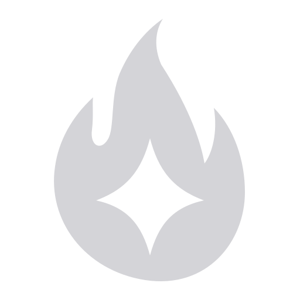

#  Burnlist

A real-time, non-invasive tracker for agents. A Burnlist stores work in a repo-local, shrinking Markdown checklist and renders progress in a local observer dashboard. Burnlist owns task state, not implementation, testing, or delivery.

## Installation

Burnlist requires Node.js 18 or newer.

```sh
npm install --global burnlist
```

The global package installs the `burnlist` command and registers the bundled Burnlist skill for Claude Code under `~/.claude/skills` and Codex under `~/.agents/skills`. Streaming Diff hooks are a separate, opt-in per-repository integration; see [Agent integrations](#agent-integrations).

Ask your agent to create a Burnlist for a goal or continue an existing one. The skill owns that workflow; the CLI provides the dashboard and protocol helpers.

Run the dashboard from any project:

```sh
burnlist
```

The server binds to loopback by default and prints its local URL.

## How It Works

A Burnlist moves through a repo-local lifecycle:

```text
notes/burnlists/
  draft/<id>/
  ready/<id>/
  inprogress/<id>/
  completed/<id>/
```

`burnlist.md` is the canonical shrinking queue. `goal.md` holds the stable contract, and `completed.md` can hold optional human-readable history. Ready work moves to `inprogress` before execution and to `completed` after the active queue is empty.

An active item is completed and validated before it leaves the checklist. The agent appends a terse completion record, deletes the active item, then validates the updated Burnlist. The lifecycle folder and `burnlist.md` remain the source of truth.

One skill owns Burnlist creation, hardening, execution, and maintenance. The project owns implementation and verification.

The dashboard scans lifecycle folders and refreshes automatically. Its progress views observe Burnlists without changing them. `New Oven` and `Run Burn` write local controller records under `.local/burnlist/` by default; they do not change canonical task state.

## Ovens

An Oven is a declarative recipe for a Burn. Its `instructions.md` defines the outcome, canonical state, required inputs, and evidence rules. Its `detail.json` defines the grid, controlled widgets, and bindings used to present normalized data.

Burnlist ships with two default Ovens:

- **Checklist** tracks the active work queue.
- **Differential Testing** renders aligned reference and candidate series, optional aggregate telemetry, and optional exact-first evidence.

Custom Ovens use the same two-file package and are scoped to the repository that owns their ignored local state; built-in Ovens are global. An Oven cannot run commands, collect or transform project data, mutate project files, import arbitrary UI, or start an agent. `--ovens-dir` overrides custom Oven storage only for the dashboard's launch repository, while other observed repositories continue to use their own `.local/burnlist/ovens/`. See the [Oven contract](skills/burnlist/references/oven-contract.md) for the complete boundary.

## Differential Testing

Projects publish a read-only comparison using `burnlist-differential-testing-data@1`. Small comparisons may bind that document directly. Large comparisons use the canonical `burnlist-differential-testing-bundle@1` transport so Burnlist validates field records sequentially and range-reads only the visible page. The project owns capture, exact-first execution, normalization, and atomic publication.

```sh
burnlist differential-testing schema
burnlist differential-testing validate /absolute/path/to/bundle/current.json
burnlist differential-testing validate-bundle /absolute/path/to/bundle/current.json
burnlist --oven-data differential-testing=/absolute/path/to/bundle/current.json
```

Aggregate refresh results remain telemetry. In exact-first mode, retained exact-prefix verification is the only retention authority.

Projects that need worker orchestration can import `createDifferentialTestingWorker` from `burnlist/differential-testing`. Public payload validation, digest, and telemetry helpers are available from `burnlist/differential-testing/contract`; scalable bundle validation and page queries are available from `burnlist/differential-testing/transport`. The SDK owns generic queueing and recovery, not project evidence authority. Run `burnlist differential-testing sdk` to print the packaged worker module path.

See the [Differential Testing data contract](skills/burnlist/references/differential-testing-data.md) and [adapter SDK reference](skills/burnlist/references/differential-testing-adapter-sdk.md) for scenario bundles, exact sessions, telemetry, and worker interfaces.

## Agent integrations

Burnlist has two independent systems. You can install the skill without hooks, hooks without the skill, or both.

### Skills: make Burnlist discoverable

`burnlist install` registers the bundled skill for both Claude Code and Codex. Its default scope is the current repository and creates managed, untracked-local skill registrations via `.git/info/exclude`:

| Agent | Per-repository target | Global target (`--global`) |
| --- | --- | --- |
| Claude Code | `<repo>/.claude/skills/burnlist` | `~/.claude/skills/burnlist` |
| Codex | `<repo>/.agents/skills/burnlist` | `~/.agents/skills/burnlist` |

```sh
# Per-repository skill only (both agents by default)
burnlist install

# Limit to one agent, or preview without writing
burnlist install --agent codex
burnlist install --dry-run

# Global skill only
burnlist install --global

# Portable per-repository copy that the team can commit
burnlist install --commit

# Remove the matching per-repository or global registration
burnlist uninstall
burnlist uninstall --global

# Also remove the global npm package (global scope only)
burnlist uninstall --global --purge
```

`--agent codex,claude` restricts either install or uninstall to the selected agents. `--commit` is per-repository only; it makes a portable copy instead of the default local registration.

### Hooks: capture Streaming Diff edits

`burnlist hooks install` is separate from skill installation. It is per-repository only (there is no global hooks mode) and merges Burnlist's edit-capture commands without replacing unrelated hooks:

| Agent that consumes the hook | Worktree-root config |
| --- | --- |
| Codex | `<repo>/.codex/hooks.json` |
| Claude Code | `<repo>/.claude/settings.json` |

Codex receives `SessionStart`, `PreToolUse`, and `PostToolUse` hooks; Claude Code also receives `PostToolUseFailure`. Edit events are limited to each agent's edit/write tools and invoke `burnlist streaming-diff hook`. Codex needs CLI version 0.124.0 or newer to run these hooks. The host needs `burnlist` on `PATH`, and the agent remains responsible for any hook trust or consent prompt.

```sh
# Hooks only, for both agents by default
burnlist hooks install

# Limit to one agent; --untracked requests a local exclude entry
burnlist hooks install --agent claude
burnlist hooks install --untracked

# Inspect or remove Burnlist-managed hooks
burnlist hooks status
burnlist hooks uninstall

# Install or remove both independent per-repository systems
burnlist install && burnlist hooks install
burnlist uninstall && burnlist hooks uninstall

# A global skill can be combined with hooks in the current repository
burnlist install --global && burnlist hooks install
```

Untracked hook configs are added to `.git/info/exclude` by default; tracked configs remain shared with the team, and `--untracked` cannot hide one. `burnlist hooks uninstall` removes only Burnlist's own hook entries and preserves the rest of the config. See the [installation reference](skills/burnlist/references/installation.md) for the full CLI surface.

## Command Line

- `burnlist --plan <burnlist.md> --check` validates the active queue and completed ledger.
- `burnlist --plan <burnlist.md> --digest` prints a completion digest after the active queue is empty.
- `burnlist --close-completed` adds a digest when needed and moves empty in-progress Burnlists to `completed`.
- `burnlist --stamp` prints a local ISO timestamp for completion records.
- `burnlist install` / `burnlist uninstall` manage the independent agent-skill registrations.
- `burnlist hooks install|uninstall|status` manages the independent per-repository Streaming Diff hooks.

Use `burnlist --help` for dashboard ports, scan roots, local state paths, and Oven data bindings.

## Build and Verify

From a source checkout:

Burnlist's CLI, server, and dashboard support Node.js 18 or newer. The Storybook
10 development commands require Node.js 20.19+ or 22.12+.

```sh
npm install
npm run build:dashboard
npm run storybook
npm run build:storybook
npm run test:differential-testing
npm run verify
npm run verify:clean
npm run verify:package
npm run test:global-install
```

`verify:clean` checks the source, npm payload, and isolated global install from a temporary copy.

## Local State

Burnlist state stays local by default. Task files live under `notes/burnlists/`; dashboard observer state, custom Ovens, and Run snapshots live under `.local/burnlist/`. Keep both paths ignored unless you deliberately want to share task state.

## License

Burnlist is licensed under the [MIT License](LICENSE).
